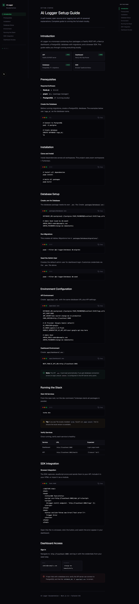
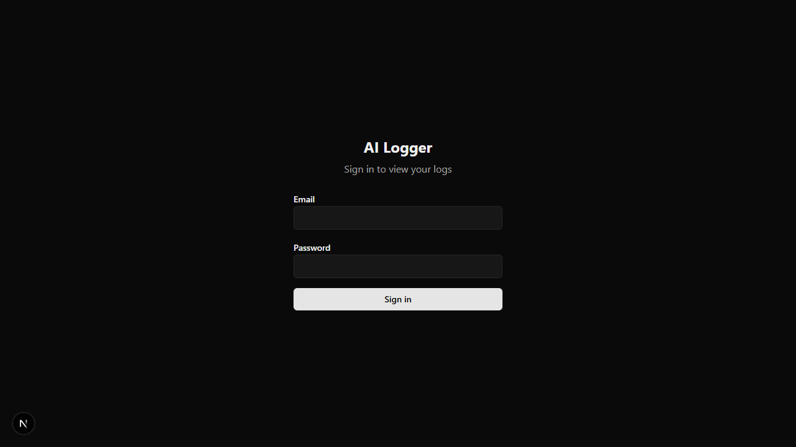

# AI Logger

Self-hosted, open-source error logging with AI-powered explanations. Capture errors, get instant plain-English analysis, causes, and fixes.

<p align="center">
  
  <br/>
  
</p>

## Why AI Logger?

- **Understand errors instantly** — AI explains what broke, why, and how to fix it
- **Self-hosted** — Your data stays on your infrastructure
- **Framework-agnostic SDK** — Works with React, Vue, Svelte, Angular, Vanilla JS
- **Bring your own AI key** — Use Google Gemini (free tier), OpenAI, or Anthropic
- **One-line integration** — Add error capture to any app in seconds

## Features

- **Browser SDK** — Capture uncaught errors and unhandled rejections automatically
- **AI Explanations** — Gemini / GPT / Claude explains errors in plain English
- **Structured Output** — Explanation, 3 possible causes, and a suggested fix
- **Multi-Provider** — Google Gemini, OpenAI, Anthropic Claude (via Vercel AI SDK)
- **Dark Mode** — Developer-first UI with terminal aesthetic
- **Monorepo** — pnpm workspaces + Turborepo for fast builds
- **Docker Compose** — One-command deployment

## Quick Start

### Prerequisites

- Node.js 22+
- pnpm 10+
- PostgreSQL 17 (or use Docker)

### One-Command Setup (Docker)

```bash
git clone https://github.com/yourusername/ai-logger.git
cd ai-logger

# Copy and configure environment
cp .env.example apps/api/.env
cp .env.example apps/dashboard/.env
# Edit apps/api/.env with your AI API key

# Start everything
docker compose up -d

# Run database setup (first time only)
pnpm install
pnpm --filter @ai-logger/database db:migrate
pnpm --filter @ai-logger/database db:seed
```

Visit:
- **Dashboard**: http://localhost:3000
- **API**: http://localhost:3001
- **Docs**: http://localhost:3002
- Default login: `admin@example.com` / `change-me-immediately`

### Local Development

```bash
# Install dependencies
pnpm install

# Start PostgreSQL (or use your local instance)
docker compose up postgres -d

# Configure environment
cp .env.example apps/api/.env
# Add your AI API key to apps/api/.env

# Run migrations & seed
pnpm --filter @ai-logger/database db:migrate
pnpm --filter @ai-logger/database db:seed

# Start all dev servers
pnpm dev
```

## SDK Usage

### Install

```bash
npm install @ai-logger/sdk
```

### Integration

```tsx
// React / Next.js
import { AiLogger } from "@ai-logger/sdk";
import { useEffect } from "react";

function App() {
  useEffect(() => {
    AiLogger.init({
      endpoint: "https://your-api.com/logs",
      autoCapture: true,
    });
  }, []);

  return <YourApp />;
}
```

```vue
<!-- Vue -->
<script setup>
import { onMounted } from "vue";
import { AiLogger } from "@ai-logger/sdk";

onMounted(() => {
  AiLogger.init({
    endpoint: "https://your-api.com/logs",
    autoCapture: true,
  });
});
</script>
```

```svelte
<!-- Svelte -->
<script>
  import { onMount } from "svelte";
  import { AiLogger } from "@ai-logger/sdk";

  onMount(() => {
    AiLogger.init({
      endpoint: "https://your-api.com/logs",
      autoCapture: true,
    });
  });
</script>
```

### Manual Logging

```ts
import { AiLogger } from "@ai-logger/sdk";

try {
  riskyOperation();
} catch (err) {
  AiLogger.log(err, { userId: "123", feature: "checkout" });
}
```

## AI Provider Configuration

Configure in `apps/api/.env`:

```env
# Google Gemini (default, free tier available)
AI_PROVIDER=google
AI_MODEL=gemini-2.0-flash
GOOGLE_GENERATIVE_AI_API_KEY=your-key

# OpenAI
AI_PROVIDER=openai
AI_MODEL=gpt-4o-mini
OPENAI_API_KEY=your-key

# Anthropic Claude
AI_PROVIDER=anthropic
AI_MODEL=claude-sonnet-4-20250514
ANTHROPIC_API_KEY=your-key
```

## Architecture

```
┌──────────┐     ┌──────────┐     ┌──────────┐     ┌──────────┐
│  Browser │────▶│ SDK      │────▶│ Fastify  │────▶│ Postgres │
│  (App)   │     │ @ai-logger│     │ API      │     │ DB       │
└──────────┘     └──────────┘     └────┬─────┘     └──────────┘
                                       │
                                       ▼
                                ┌──────────┐
                                │ AI       │
                                │ Gemini / │
                                │ GPT /    │
                                │ Claude   │
                                └────┬─────┘
                                     │
                                     ▼
                                ┌──────────┐
                                │ Next.js  │
                                │ Dashboard│
                                └──────────┘
```

## API Reference

| Method | Route | Auth | Description |
|--------|-------|------|-------------|
| POST | `/auth/login` | Public | Admin login → JWT |
| POST | `/logs` | Open | Ingest error log |
| GET | `/logs` | JWT | List logs (supports `?search=`) |
| GET | `/logs/:id` | JWT | Get single log detail |
| POST | `/logs/:id/explain` | JWT | Trigger AI explanation |

## Project Structure

```
ai-logger/
├── apps/
│   ├── api/              # Fastify 5.8 REST API
│   ├── dashboard/        # Next.js 16.2 admin dashboard
│   └── docs/             # Next.js 16.2 documentation site
├── packages/
│   ├── database/         # PostgreSQL client & migrations
│   └── sdk/              # Browser error capture SDK
├── docker-compose.yml
├── turbo.json            # Turborepo configuration
└── docs/
    ├── phases.md         # Development roadmap
    └── screenshots/      # UI screenshots
```

## Tech Stack

| Layer | Tech | Version |
|-------|------|---------|
| API | Fastify | 5.8 |
| Dashboard | Next.js (App Router) | 16.2 |
| Docs | Next.js (App Router) | 16.2 |
| Database | PostgreSQL | 17 |
| Migrations | node-pg-migrate | latest |
| AI SDK | Vercel AI SDK | v4 |
| Styling | Tailwind CSS | 4 |
| Build | Turborepo | 2.5 |
| Package Manager | pnpm | 10 |

## Contributing

We welcome contributions! See [CONTRIBUTING.md](./CONTRIBUTING.md) for:
- Development setup
- Code conventions
- Pull request process
- Project structure

## License

MIT — see [LICENSE](./LICENSE) for details.

## Acknowledgments

Built with [Vercel AI SDK](https://sdk.vercel.ai/), [Fastify](https://fastify.dev/), and [Next.js](https://nextjs.org/).
